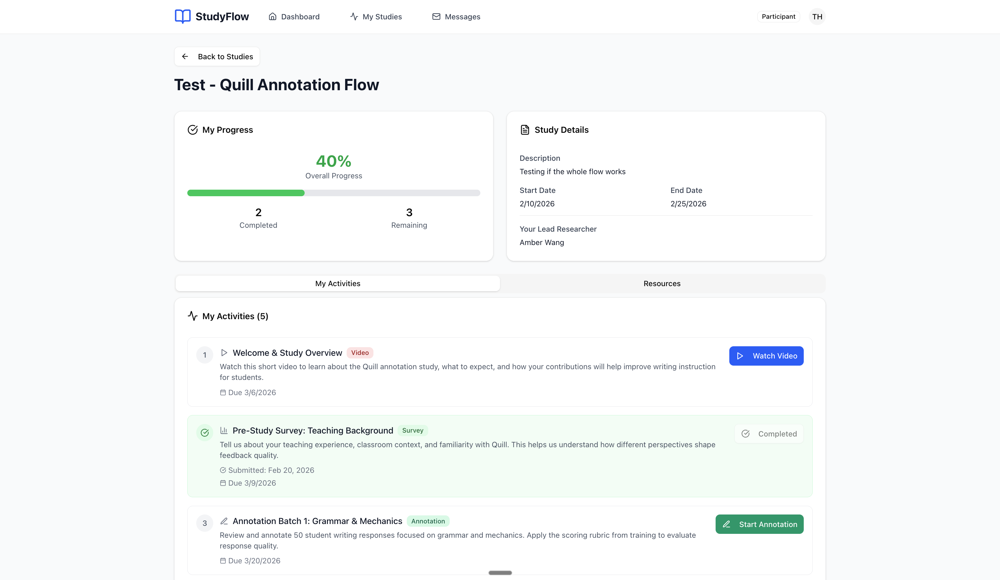
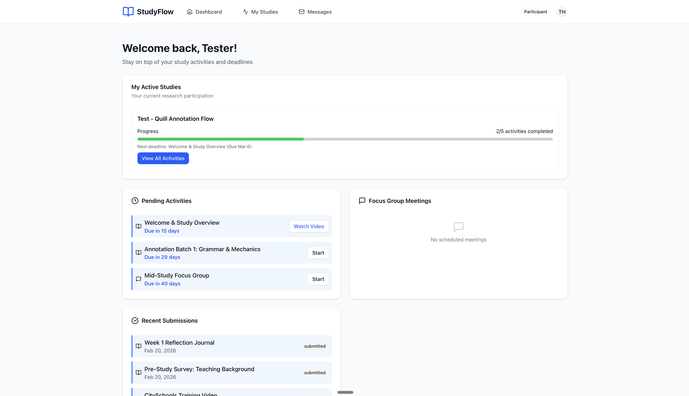

# StudyFlow

A research operations platform that helps Leanlab Education manage studies, track participant progress, and streamline researcher workflows. In production at [studyflow.leanlabeducation.org](https://studyflow.leanlabeducation.org).

> **Note:** This is a showcase repo. StudyFlow is an internal platform for Leanlab Education — source code is in a private repository.





## What It Does

StudyFlow replaces spreadsheets and manual tracking for education research studies. It serves three user types:

- **Participants (teachers)** — View assigned studies, submit work (diaries, surveys, focus group availability), track progress, and see stipend calculations
- **Champions (lead teachers)** — Monitor progress of teachers at their school
- **Staff (researchers)** — Manage studies end-to-end: create activities, schedule focus groups, review submissions, send communications, calculate stipends

## Tech Stack

| Layer | Technology |
|-------|-----------|
| **Framework** | Next.js 15, React 19, TypeScript |
| **Styling** | Tailwind CSS 4, shadcn/ui, Radix UI |
| **Database** | Supabase (PostgreSQL with Row-Level Security) |
| **Auth** | Supabase Auth |
| **File Storage** | Supabase Storage (signed URLs) |
| **External Data** | Airtable API (bi-directional sync) |
| **Email** | Resend |
| **PDF** | jsPDF |
| **Uploads** | tus-js-client (resumable) |
| **Testing** | Vitest, React Testing Library, MSW |
| **Deployment** | Vercel (primary), Netlify (backup) |

## Key Features

### Activity System
Flexible activity types that researchers can configure per study:
- **Diary** — journaling prompts with due dates
- **Survey** — questionnaires with external URL support
- **Focus Group** — full session management with scheduling polls, participant voting, auto-assignment
- **Scheduling** — availability polls for coordinating sessions

### Airtable Integration
Bi-directional sync with Leanlab's existing Airtable workflows:
- **Studies & People**: Airtable → App (scheduled sync)
- **Progress & Submissions**: App → Airtable (real-time)
- Preserves researcher workflows while giving participants a modern interface

### Stipend Calculation
Automatic bracket-based stipend calculations tied to participant completion:
- <10% → 10% of stipend
- <50% → 50% of stipend
- <80% → 80% of stipend
- ≥80% → 100% of stipend

### Recruitment & Onboarding
- Public landing pages for study recruitment (`/apply/[slug]`)
- Interest form collection and eligibility tracking
- ICA (Informed Consent Agreement) signing flow
- Participant onboarding wizard

### Staff Tools
- Study creation wizard with activity templates
- Visual calendar for focus group scheduling
- Submission review and approval
- In-app messaging and email communications
- Analytics and progress dashboards

## Architecture

```
Teacher / Researcher → Next.js 15 (App Router)
                         ├── Supabase Auth (role-based access)
                         ├── Supabase PostgreSQL
                         │     ├── studies, activities, submissions
                         │     ├── users, study_participants
                         │     ├── messages, notifications
                         │     ├── interest_forms, ica_signatures
                         │     └── Row-Level Security policies
                         ├── Supabase Storage (file uploads)
                         ├── Airtable API (bi-directional sync)
                         └── Resend (transactional email)
```

## Status

In production. Used by Leanlab Education researchers and participating teachers across multiple active studies.
