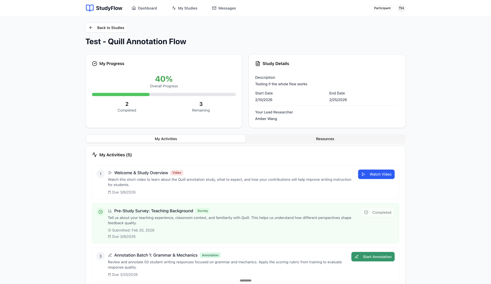
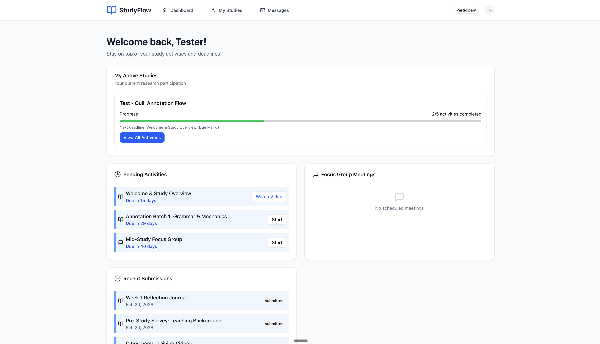

# StudyFlow

Research operations platform for Leanlab Education. Runs the full lifecycle of edtech research studies: recruitment, onboarding and e-signatures, activities and progress tracking, messaging, scheduling, and stipend payments. In production at [studyflow.leanlabeducation.org](https://studyflow.leanlabeducation.org).

> Showcase repo. Source is private. Built and maintained as sole engineer.

## What it does

Three roles: **staff** (researchers), **participants** (teachers), and **champions** (lead teachers who see their school's progress).

- **Studies and activities.** Six activity types (diary, survey, focus group, scheduling, video, task), activity groups, templates, Treatment/Control targeting, progress tracking.
- **Recruitment.** Public landing pages at `/apply`, eligibility scoring, response management, interest-form email flows.
- **Onboarding and e-signatures.** Token-based ICA signing with account creation, MOU signing for school partners, onboarding dashboard.
- **Payments.** Stripe Connect stipend payouts, paper check lifecycle, school grant payments, bracket-based stipend finalization, finance approval workflow, Slack alerts and digests. $250K+ per year flows through it.
- **Messaging.** Conversation threads with real email threading via Resend inbound webhooks, templates, bulk sends, automated reminders on a daily cron gated by study stage.
- **Scheduling.** Focus group availability polls, visual calendar, auto-assignment.

## PilotFlow

An AI research-design assistant inside StudyFlow. Finalist, Renaissance Philanthropy AI Talent Accelerator.

- **Layer 1, evidence consultation.** Educators ask about edtech tools or approaches. The query is embedded (Together AI), matched by pgvector cosine similarity against a research corpus plus EdReports and What Works Clearinghouse corpora, and synthesized by Claude. A Gemini query planner routes fast paths.
- **Layer 2, guided study design.** Step-advancing conversation that produces study artifacts (generate and revise), with attachments, team invites, and per-organization usage metering.

## Engineering

- **Supabase Postgres with RLS on every table.** Role checks live in the database, not just the app.
- **Quality gates.** Vitest unit and integration, Playwright E2E against Vercel previews, a CI error-count ratchet that fails only if a change adds errors, pre-push hook.
- **Deploy.** Push to `main` deploys to Vercel and to Netlify as a hot backup, with a documented DNS failover runbook. Money, auth, and schema changes go through PR so CI can block the merge.
- **Secrets.** Doppler, synced to Vercel. No secret values anywhere in the repo or docs.
- **Passwordless dev login.** A script mints a session for any user via the admin API, so nobody types passwords, even for test accounts.

## Stack

| Layer | Technology |
|---|---|
| App | Next.js 15 (App Router), React 19, TypeScript, Tailwind CSS, shadcn/ui |
| Database, auth, storage | Supabase (PostgreSQL, RLS, signed URLs) |
| Payments | Stripe Connect Express |
| Email | Resend (send + inbound webhooks) |
| AI | Anthropic Claude, Together AI embeddings, Gemini, pgvector |
| Integrations | Airtable, Slack, Calendly (signed webhooks), Converge (JWT magic-link SSO) |
| Hosting | Vercel primary, Netlify backup, Doppler secrets |
| Testing | Vitest, Playwright, MSW |
